  

  
  
  
  

## // o que eu faço

| ⬢ **Engenharia de Software** | ⚡ **Sistemas Inteligentes** |
|:---|:---|
| Clean Architecture, DDD, CQRS e design patterns aplicados com disciplina. Código limpo, testável e que escala — não apenas "funciona". | LLMs, RAG, LangGraph, MCP e multi-agent systems. Construo agentes que planejam, executam e se auto-corrigem. |

| 🎬 **Interfaces Cinematográficas** | 🏛️ **Engenharia de Dados** |
|:---|:---|
| Estética Apple-like: dark mode, glassmorphism, scrollytelling, WebGL e micro-interações que transformam produto em experiência. | Modelagem relacional, PostgreSQL, Redis, SQL otimizado e pipelines ETL com automação em Python. |

## // stack

  
  
  
  
  
  
  
  
  
  
  
  
  
  
  
  
  
  

## // projetos em destaque

### ⬢ [Izanagi AI](https://github.com/pedrohenriquesanchesleal4-debug/izanagi-ai)
> Framework meta para engenharia de software autônoma: 12 agentes especializados, 79+ skills, engines de decisão/contexto/memória e CLI publicada no npm. O sistema operacional do dev autônomo.

### 🌐 [Site Izanagi](https://github.com/pedrohenriquesanchesleal4-debug/SiteIzanagi)
> Site oficial do framework — estética Apple-like com glassmorphism, scrollytelling, animações de scroll e micro-interações. Uma experiência, não uma página.

### 📚 [Sistema de Cadastro de Livros](https://github.com/pedrohenriquesanchesleal4-debug/Sistema-de-Cadastro-de-Livros)
> CRUD completo em C#/.NET 8: cadastro, exclusão e listagem de livros com boas práticas de organização e validação.

### 🚀 [Portfólio v2](https://pedrohsl-portfolio.vercel.app)
> Meu portfólio profissional: projetos reais, stack full-stack e IA aplicada. Tema dark cinematográfico com foco em performance e produto.

  
<b>📦 Outros repositórios</b>

  - **Calculadora-Simples** — Calculadora com operações básicas e decimais em C#/.NET 8
  - **Verificador-de-numeros-impares-ou-pares** — Verificador par/ímpar em C#/.NET 8
  - **Portfólio-v1** — Meu primeiro portfólio

## // métricas

  
  

  

## // contato

  
  
  
  

---

*⬢ const craft = discipline + architecture + taste — nunca "cara de IA"*

